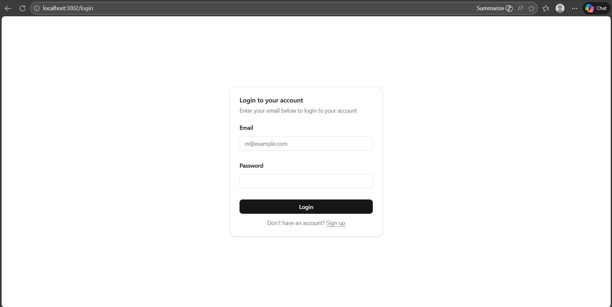
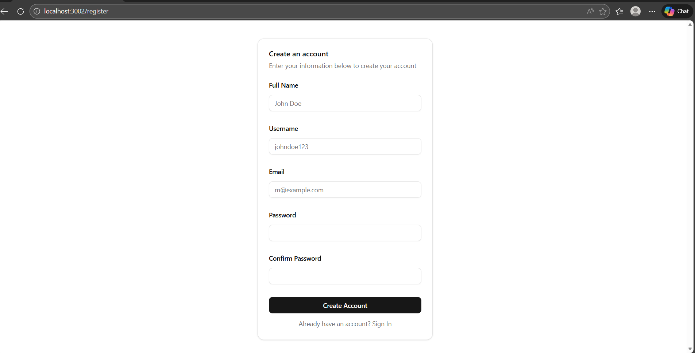

# Task Management System

Aplikasi manajemen tugas (Task Management) berbasis web yang memungkinkan
pengguna untuk membuat, mengelola, dan melacak status tugas mereka. Aplikasi ini
dibangun dengan arsitektur Full Stack menggunakan Node.js untuk backend dan
Next.js untuk frontend.

## 🚀 Fitur Utama

- ✅ Autentikasi pengguna (Register & Login)
- ✅ CRUD Task (Create, Read, Update, Delete)
- ✅ Status task (To Do, In Progress, Done)
- ✅ Deadline management
- ✅ Dashboard dengan statistik task
- ✅ Real-time updates
- ✅ Responsive design

## 🛠️ Teknologi yang Digunakan

### Backend

- **Node.js** - Runtime JavaScript
- **Express.js** - Web framework
- **TypeScript** - Type-safe programming
- **TypeORM** - ORM untuk database
- **MySQL** - Relational database
- **JWT** - Authentication & authorization
- **Bcrypt** - Password hashing
- **Zod** - Schema validation
- **Winston** - Logging system

### Frontend

- **Next.js 15** - React framework
- **TypeScript** - Type-safe programming
- **NextAuth.js** - Authentication
- **TanStack Query** - Data fetching & caching
- **React Hook Form** - Form management
- **Zod** - Schema validation
- **Tailwind CSS** - Styling
- **Shadcn/ui** - UI components
- **Axios** - HTTP client

### DevOps

- **Docker** - Containerization
- **Docker Compose** - Multi-container orchestration

## 📋 Prerequisites

Sebelum menjalankan aplikasi, pastikan telah terinstall:

- [Docker](https://www.docker.com/get-started) (versi 20.10 atau lebih baru)
- [Docker Compose](https://docs.docker.com/compose/install/) (versi 2.0 atau
  lebih baru)

## 🏃 Cara Menjalankan Aplikasi

### Menggunakan Docker (Recommended)

1. Clone repository ini

```bash
git clone <repository-url>
cd task-management
```

2. Jalankan aplikasi menggunakan Docker Compose

```bash
docker compose up -d --build
```

3. Tunggu beberapa saat hingga semua container berjalan. Aplikasi akan tersedia
   di:

   - **Frontend**: http://localhost:3002
   - **Backend API**: http://localhost:3001
   - **MySQL Database**: localhost:3307

4. Untuk menghentikan aplikasi:

```bash
docker compose down
```

5. Untuk menghapus semua data termasuk database:

```bash
docker compose down -v
```

### Menjalankan Manual (Development)

#### Backend

1. Masuk ke folder backend

```bash
cd backend
```

2. Install dependencies

```bash
yarn install
```

3. Copy file `.env.example` menjadi `.env`

```bash
cp .env.example .env
```

4. Sesuaikan konfigurasi database di file `.env`

5. Jalankan migration database

```bash
yarn migration:run
```

6. Jalankan development server

```bash
yarn dev
```

Backend akan berjalan di http://localhost:3001

#### Frontend

1. Masuk ke folder frontend

```bash
cd frontend
```

2. Install dependencies

```bash
npm install
```

3. Copy file `.env.example` menjadi `.env`

```bash
cp .env.example .env
```

4. Sesuaikan konfigurasi di file `.env`

5. Jalankan development server

```bash
npm run dev
```

Frontend akan berjalan di http://localhost:3000

## 👤 Informasi Login Dummy

Setelah aplikasi berjalan, silakan register akun baru melalui halaman:
http://localhost:3002/register

Atau gunakan data berikut yang di dapat darai db.sql untuk testing (jika sudah
ada seeder):

```
Email: mizzy12342@gmail.com
Password: 1234567890
```

## 🗄️ Struktur Database

### Tabel: `user`

| Field      | Type         | Constraint       | Deskripsi             |
| ---------- | ------------ | ---------------- | --------------------- |
| user_id    | VARCHAR(36)  | PRIMARY KEY      | UUID pengguna         |
| username   | VARCHAR(100) | UNIQUE, NOT NULL | Username unik         |
| name       | VARCHAR(255) | NOT NULL         | Nama lengkap pengguna |
| email      | VARCHAR(100) | UNIQUE, NOT NULL | Email unik            |
| password   | VARCHAR(100) | NOT NULL         | Password (hashed)     |
| created_at | TIMESTAMP    | DEFAULT NOW()    | Waktu pembuatan akun  |
| updated_at | TIMESTAMP    | DEFAULT NOW()    | Waktu update terakhir |

### Tabel: `task`

| Field       | Type         | Constraint      | Deskripsi                        |
| ----------- | ------------ | --------------- | -------------------------------- |
| task_id     | VARCHAR(36)  | PRIMARY KEY     | UUID task                        |
| user_id     | VARCHAR(36)  | FOREIGN KEY     | Referensi ke user                |
| title       | VARCHAR(255) | NOT NULL        | Judul task                       |
| description | TEXT         | NOT NULL        | Deskripsi task                   |
| status      | ENUM         | DEFAULT 'to_do' | Status: to_do, in_progress, done |
| deadline    | DATETIME     | NULLABLE        | Batas waktu task                 |
| created_by  | VARCHAR(255) | NOT NULL        | Nama pembuat task                |
| created_at  | TIMESTAMP    | DEFAULT NOW()   | Waktu pembuatan task             |

### Relasi

- `task.user_id` → `user.user_id` (Many to One)
- Satu user dapat memiliki banyak task
- Task dihapus otomatis jika user dihapus (CASCADE)

## 📸 Screenshots

### Halaman Login



### Halaman Register



### Dashboard


### Task List


### Create Task


## 📁 Struktur Project

```
task-management/
├── backend/                    # Backend API
│   ├── src/
│   │   ├── application/       # App configuration
│   │   ├── controller/        # Route controllers
│   │   ├── database/          # Database entities & migrations
│   │   ├── middleware/        # Express middlewares
│   │   ├── model/             # Data models
│   │   ├── route/             # API routes
│   │   ├── service/           # Business logic
│   │   ├── validation/        # Input validation
│   │   └── index.ts           # Entry point
│   ├── Dockerfile
│   └── package.json
├── frontend/                   # Frontend Next.js
│   ├── src/
│   │   ├── app/               # Next.js app directory
│   │   ├── components/        # React components
│   │   ├── hooks/             # Custom hooks
│   │   ├── lib/               # Utilities
│   │   └── types/             # TypeScript types
│   ├── Dockerfile
│   └── package.json
├── screenshots/                # Screenshot aplikasi
├── docker-compose.yml          # Docker orchestration
└── README.md                   # Dokumentasi
```

## 🔧 Environment Variables

### Backend (.env)

```env
APP_URL=http://localhost:3001
PORT=3001
ALLOWED_ORIGINS=http://localhost:3000,http://localhost:3002
DB_HOST=localhost
DB_PORT=3306
DB_USERNAME=root
DB_PASSWORD=root
DB_NAME=task_management
NODE_ENV=development
JWT_SECRET=your-jwt-secret-key
JWT_REFRESH_SECRET=your-refresh-secret-key
JWT_EXPIRES_IN=1800s
JWT_REFRESH_EXPIRES_IN=86400s
```

### Frontend (.env)

```env
NEXT_PUBLIC_BACKEND_URL=http://localhost:3001/api
NEXTAUTH_SECRET=your-nextauth-secret-key
NEXTAUTH_URL=http://localhost:3000
```

## 🧪 Scripts Backend

```bash
yarn dev              # Jalankan development server
yarn build            # Build untuk production
yarn start            # Jalankan production server
yarn migration:generate  # Generate migration dari entities
yarn migration:run    # Jalankan migration
yarn migration:revert # Rollback migration terakhir
yarn db:seed          # Jalankan database seeder
```

## 🧪 Scripts Frontend

```bash
npm run dev           # Jalankan development server
npm run build         # Build untuk production
npm run start         # Jalankan production server
npm run lint          # Jalankan ESLint
```

## 📝 API Endpoints

### Authentication

- `POST /api/register` - Register user baru
- `POST /api/login` - Login user
- `POST /api/logout` - Logout user
- `POST /api/refresh-token` - Refresh access token

### Tasks

- `GET /api/tasks` - Mendapatkan semua task user
- `POST /api/tasks` - Membuat task baru
- `PUT /api/tasks/:id` - Update task
- `DELETE /api/tasks/:id` - Hapus task

## 🔒 Security Features

- ✅ Password hashing dengan bcrypt
- ✅ JWT authentication
- ✅ Refresh token mechanism
- ✅ CORS protection
- ✅ Rate limiting
- ✅ Input validation dengan Zod
- ✅ SQL injection prevention (TypeORM)
- ✅ XSS protection

## 📄 License

MIT License

## 👨‍💻 Developer

Dibuat dengan ❤️ by Mizzy untuk keperluan Task Management System

---

**Note**: Pastikan port 3001, 3002, dan 3307 tidak digunakan oleh aplikasi lain
sebelum menjalankan Docker Compose.
